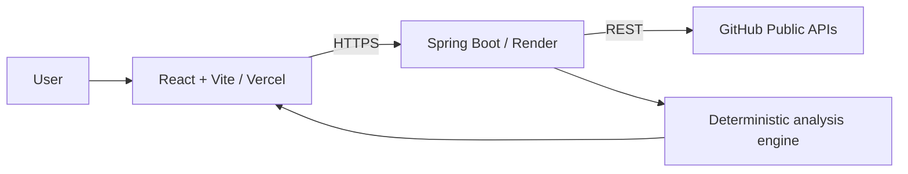

# RepoRadar

> **Scan. Analyze. Improve.**

RepoRadar is a production-ready developer productivity application that turns public GitHub repository data into an understandable health score, visual analytics, documentation findings, technology signals, and focused improvement suggestions.

It has no accounts, database, stored reports, or direct browser-to-GitHub calls. Paste a public repository URL and receive an analysis in seconds.

##  Live Demo

**Try RepoRadar:** https://repo-radar-23.vercel.app/

Analyze any public GitHub repository directly from your browser—no sign-up or installation required.

## Features

- Strict public GitHub URL validation and friendly, safe errors
- Dedicated backend GitHub client with timeouts, one safe retry, rate-limit handling, and response transformation
- Deterministic, transparent 100-point repository health score
- Repository metadata, metrics, activity, community, branch, release, and contributor signals
- README checklist with strengths, gaps, recommendations, and score
- Technology detection from repository file paths, configuration, dependencies, and README text
- Project-structure insight and actionable recommendation engine
- Responsive React dashboard with Chart.js language donut
- Professional browser-generated PDF report with summary, health score, language chart, and suggestions
- Render health endpoint, CORS configuration, Vercel SPA routing, and environment-only API configuration

## Architecture



See the detailed [architecture documentation](docs/architecture.md).

## Technology Stack

| Area | Technology |
| --- | --- |
| Backend | Java 21, Spring Boot, Spring Web, Validation, Jackson, Lombok, Maven Wrapper |
| Frontend | React, Vite, Tailwind CSS, Axios, React Router, Chart.js, Lucide |
| Report export | jsPDF, generated in the browser |
| Deployment | Render (backend), Vercel (frontend) |
| Data source | GitHub REST API |

## Project Structure

```text
RepoRadar/
├── backend/     
├── frontend/   
├── docs/        
├── render.yaml  
├── LICENSE
└── README.md
```

For a complete map, read [docs/folder-structure.md](docs/folder-structure.md).

## Prerequisites

- Git 2.40+
- JDK 21+ (the app targets Java 21)
- Node.js 20+ and npm 10+
- A modern browser
- Optional but recommended: a GitHub personal access token with no extra scopes for higher public-API quota

Recommended IDEs: IntelliJ IDEA for the backend and VS Code for the frontend.

## Run Locally

### 1. Clone and enter the project

```bash
git clone <your-repository-url>
cd RepoRadar
```

### 2. Configure the backend

Copy `backend/src/main/resources/application.properties.example` into your environment or set its variables in your shell. For local development, the essential values are:

```properties
PORT=8080
GITHUB_API_URL=https://api.github.com
GITHUB_TOKEN=
CORS_ALLOWED_ORIGINS=http://localhost:*,http://127.0.0.1:*
```

The supplied `application.properties` already provides safe local defaults; add `GITHUB_TOKEN` through your shell or IDE environment rather than committing it.

Windows PowerShell:

```powershell
cd backend
$env:GITHUB_TOKEN = "optional-github-token"
.\mvnw.cmd clean install
.\mvnw.cmd spring-boot:run
```

macOS/Linux:

```bash
cd backend
export GITHUB_TOKEN="optional-github-token"
./mvnw clean install
./mvnw spring-boot:run
```

The backend starts at `http://localhost:8080`. Confirm it with `http://localhost:8080/health`.

### 3. Configure and run the frontend

Create `frontend/.env` from the included example and set the local backend address:

```dotenv
VITE_API_BASE_URL=http://localhost:8080
```

Windows PowerShell:

```powershell
cd frontend
Copy-Item .env.example .env
npm install
npm run dev
```

macOS/Linux:

```bash
cd frontend
cp .env.example .env
npm install
npm run dev
```

Open `http://localhost:5173`, paste a public repository URL such as `https://github.com/spring-projects/spring-boot`, and analyze it.

## Verified Build Commands

Backend:

```bash
cd backend
./mvnw clean verify
java -jar target/reporadar-api-1.0.0.jar
```

Frontend:

```bash
cd frontend
npm install
npm run build
npm run preview
```

## Environment Variables

### Backend

| Variable | Required | Default | Purpose |
| --- | --- | --- | --- |
| `PORT` | No | `8080` | HTTP port; Render supplies this automatically. |
| `GITHUB_API_URL` | No | `https://api.github.com` | GitHub REST API origin. |
| `GITHUB_TOKEN` | Recommended | empty | Optional GitHub token for a higher rate limit; server-only. |
| `GITHUB_CONNECT_TIMEOUT_SECONDS` | No | `8` | Outbound connection timeout. |
| `GITHUB_READ_TIMEOUT_SECONDS` | No | `15` | Outbound request timeout. |
| `CORS_ALLOWED_ORIGINS` | Yes in production | `http://localhost:*,http://127.0.0.1:*` | Comma-separated browser origins. Wildcards are useful for local development; use exact HTTPS origins in production. |

### Frontend

| Variable | Required | Purpose |
| --- | --- | --- |
| `VITE_API_BASE_URL` | Yes | Full backend base URL; use `http://localhost:8080` locally and your HTTPS Render URL in production. |

Never put `GITHUB_TOKEN` in a Vite variable: browser variables are public after build.

## Built With

RepoRadar is built using:

- GitHub REST API
- Spring Boot
- React
- Vite
- Tailwind CSS
- Chart.js
- Lucide
- jsPDF

## API Documentation

| Endpoint | Method | Purpose |
| --- | --- | --- |
| `/api/analyze?repositoryUrl={url}` | GET | Analyze a single public GitHub repository. |
| `/health` | GET | Service health and version for Render monitoring. |

Complete request, response, status-code, and error documentation is in [docs/api.md](docs/api.md).

## Deploy

### Backend — Render

1. Create a Render account and connect the GitHub repository.
2. Create a Web Service (or create a Blueprint from `render.yaml`).
3. Select `backend` as the root directory and Java 21 as the runtime.
4. Use build command `./mvnw clean package -DskipTests`.
5. Use start command `java -Dserver.port=$PORT -jar target/reporadar-api-1.0.0.jar`.
6. Set `GITHUB_API_URL=https://api.github.com`, optionally set `GITHUB_TOKEN`, and set `CORS_ALLOWED_ORIGINS` to your exact Vercel URL.
7. Set health check path to `/health`, deploy, and open `https://<render-service>/health`.

### Frontend — Vercel

1. Create a Vercel account and import the same GitHub repository.
2. Select `frontend` as the root directory.
3. Set `VITE_API_BASE_URL=https://<render-service>`.
4. Vercel runs `npm run build`; deploy it.
5. Open the Vercel URL, analyze a public repository, and export its PDF report.

If the backend URL changes, update `VITE_API_BASE_URL` in Vercel and redeploy the frontend. Update `CORS_ALLOWED_ORIGINS` only if the frontend origin also changed. See [docs/deployment.md](docs/deployment.md) for troubleshooting and full verification steps.

## Easiest Local Start (Windows)

From the repository root:

```powershell
.\run-backend.ps1
```

Open a second terminal from the repository root:

```powershell
.\run-frontend.ps1
```

Then open the frontend URL shown in the terminal (usually `http://localhost:5173`).

## Common Troubleshooting

| Problem | Resolution |
| --- | --- |
| Frontend says API URL is not configured | Create `frontend/.env`, set `VITE_API_BASE_URL`, then restart Vite. |
| Browser CORS error | In production, ensure backend `CORS_ALLOWED_ORIGINS` exactly matches the frontend origin (scheme included, no trailing slash). For local development, `http://localhost:*` and `http://127.0.0.1:*` are supported by default. |
| GitHub rate limit message | Wait for the reset or configure a server-side `GITHUB_TOKEN`. |
| Repository not found | Confirm the repository is public and the URL is exactly `https://github.com/owner/repository`. |
| Render health check fails | Verify `PORT` is not overridden and the check path is `/health`. |
| Java build uses wrong release | Install/select JDK 21+ and check `java -version`. |

## Future Roadmap

Version 1.1: repository comparison, advanced filters, improved scoring.

Version 2.0: GitHub profile analysis, portfolio analysis, saved reports, authentication, AI-powered recommendations.

Version 3.0: organization analytics, team dashboards, repository history, trend analysis.

These items are not implemented in v1.0. See [docs/future-improvements.md](docs/future-improvements.md).

## Contributing

1. Create a feature branch.
2. Keep changes focused and maintain the existing layered architecture.
3. Run `./mvnw clean verify` in `backend` and `npm run build` in `frontend`.
4. Open a pull request with a clear problem statement and validation notes.

Suggested commit history: `Initial project setup`, `Backend architecture`, `GitHub API integration`, `Analysis engine`, `Frontend UI`, `Dashboard`, `Charts`, `README`, `Deployment configuration`, and `Final polish`.

## License

Released under the [MIT License](LICENSE).

---

<p align="center">
  <strong>© 2026 Harshil Gurjar. All Rights Reserved.</strong>
</p>
