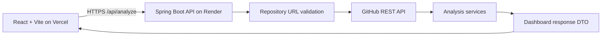

# Architecture Overview

RepoRadar is deliberately split into two independently deployable applications. The browser never calls GitHub directly, so tokens, rate-limit handling, response shaping, and validation remain on the server.

## Backend layers

- `controller`: receives HTTP requests and returns the common response envelope.
- `service`: README, technology, health, suggestion, and aggregation logic.
- `client`: one GitHub REST client with headers, timeout, retry, rate-limit mapping, and response parsing.
- `utils`: reusable URL and JSON helpers.
- `dto`: public API shapes only; raw GitHub payloads are never returned.
- `exception`: user-safe global error handling.

The health engine is deterministic. The weights stated in the PRD total 110 rather than 100, so the implementation normalizes them by their 110 total while retaining each specified relative weighting.

## Frontend layers

- `pages`: landing and dashboard route experiences.
- `components`: reusable navigation, form, loading, error, and brand UI.
- `services`: Axios API boundary.
- `utils`: URL validation, display formatting, and browser PDF generation.
- `styles`: Tailwind base and shared component styles.

The dashboard route is lazy-loaded to keep the initial landing-page download small. PDF generation is also loaded only when the user exports a report.

